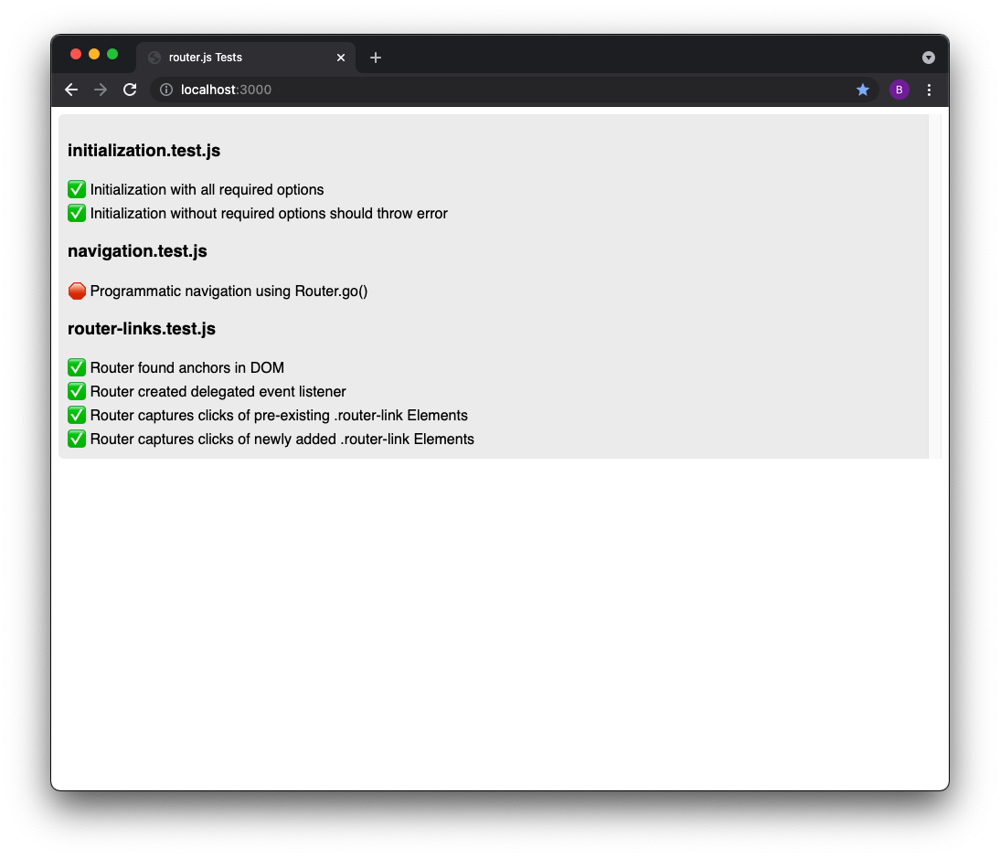

# es6-test-tools

A small collection of tools for testing JavaScript in modern ES6 browser
environments. Files use ES6 exports, so there's no need for transpiling or
messing around with getting set up.

Additionally, this comes with an Express server for delivering test suits to the
browser, so that your ES6 imports work out of the box.

For testing JavaScript that uses CommonJS packages, I suggest the well
established [node-tap](https://node-tap.org/) project instead.



## Getting Started

### 1. Install with npm

```
npm i "github:somebeaver/es6-test-tools"
```

### 2. Add the npm script

```
"scripts": {
  "ett-server": "node ./node_modules/es6-test-tools/index.js"
}
```

### 3. Create the test suite

You must create a folder in your project root called `test`. Inside of it,
create a file called `es6-test-tools-suite.js`. This file will be served to the
browser, and it is the root of your testing suite. Use it to run tests directly,
or import other ES6 test modules directly.

All of the testing tools are available to you globally under `window.ett`.

```javascript
// test/es6-test-tools-suite.js

import { exampleTest } from './example.test.js'
exampleTest()
```

```javascript
// test/example.test.js

import { thingToTest1, thingToTest2, thingToTest3 } from './example.test.js'

// the UI and the console will show you whether this test passes or not
ett.mustBeTrue(typeof thingToTest1 === 'function')
```

### 4. Start the server

Once your test suite is ready to run, start the server by running the script
from step 2.

```
$ npm run ett-server
```

Then browse to `localhost:3000` in any browser with an ES6 environment that you
want to run your test suite in.

## Testing Tools

All of these functions are available globally under `ett`. All functions except
`output()` take the same two args at the end:

- `test` (string) - The name of the test.
- `msg` (string) - A message associated with this test.

### `ett.output(...args)`
Generic textual output in the UI.

#### `ett.pass(test, msg)`
Outputs a single line to the output box with a green checkmark.

#### `ett.fail(test, msg)`
Outputs a single line to the output box with a red stop sign.

#### `ett.mustBeTrue(thing, test, msg)`
Invokes `pass()` or `fail()` depending on if the given value is true.

#### `ett.mustBeTruthy(thing1, thing2, test, msg)`
Invokes `pass()` or `fail()` depending on if the given value is truthy.

#### `ett.isEqual(thing1, thing2, test, msg)`
Invokes `pass()` or `fail()` depending on if the two given things are strictly
equal.

## Questions and Answers

#### How do I use html/css/image files in my tests?

Express is serving your entire project root as statically available files. So,
to include anything else you might need, just use paths relative to the root.

To load an image that's located at `test/images/cat.jpg`

```html

```